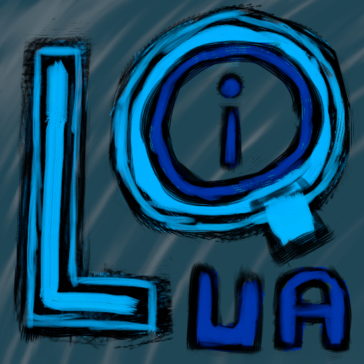

# Lua-QOI
# 

Lua bindings to the QOI (“Quite OK Image”) library (https://github.com/phoboslab/qoi)

## Example
```lua
local qoi = require "lua-qoi"
local image = qoi.read("hello.qoi")
local x, y = image.width / 2, image.height / 2
image:setPixel(x, y, 255, 255, 255)
image:write("world.qoi")
```
See more examples in the [test](test) directory.
#
## Functions
### **`qoi.read(path, [channels: 0]) -> image`**
Reads a QOI image from the given path. The channels argument is optional and defaults to 0, meaning the channels from the file are used.
### **`qoi.new(width, height, [channels: 4]) -> image`**
Creates a new QOI image with the given dimensions. The `channels` parameter is optional and defaults to 4.
### **`qoi.decode(data) -> image`**
Decodes a QOI image from a binary string.
### **`image:write(path)`**
### or `qoi.write(image, path)`
Writes a QOI image to the given path.
### **`image:encode() -> string`**
### or `qoi.encode(image) -> string`
Encodes a QOI image to a binary string.
### **`image:getPixel(x, y) -> r, g, b, a`**
### or `qoi.getPixel(image, x, y) -> r, g, b, a`
Returns the pixel at the given coordinates. The returned values are in the range [0, 255].
### **`image:setPixel(x, y, r, g, b, [a: 255])`**
### or `qoi.setPixel(image, x, y, r, g, b, [a: 255])`
Sets the pixel at the given coordinates. The values must be in the range [0, 255]. The `a` parameter is optional and defaults to 255.
#
## Image properties
### **`image.width`**
Image width.
### **`image.height`**
Image height.
### **`image.channels`**
Image channels.
#
## Building
To build this library, run:
### Win32:
```bash
$ build.bat
```
> For building for a specific Lua version, change `find_package(Lua 5.1 EXACT REQUIRED)` to what you need in CMakeLists.txt. For example, `find_package(Lua 5.3 EXACT REQUIRED)` for Lua 5.3.
#
## Testing
To test this library, run:
```bash
$ cd test
$ lua all.lua
```
> This library has been tested with Lua 5.1, 5.3 and 5.4.
#
## License
This library is released under the MIT license.